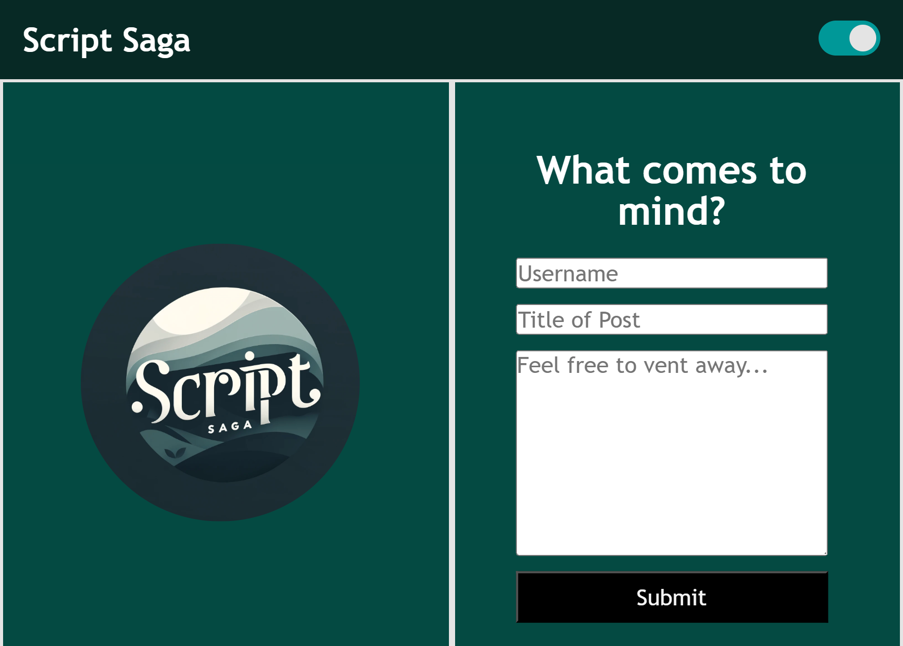

# Script-Saga

## This project centered around crafting a personal blog for coders who need to vent, intended for users to be able to sharing their coding insights and endeavors.

- Script Saga simplifies the process of creating and browsing posts, emphasizing simplicity and interactivity for the user. Developing this blog platform significantly enhanced my proficiency in developing web forms, manipulating local storage, and integrating user-friendly functionalities, such as a consistent and functioning light/dark mode.

## User Interface

- When users first access the application, they encounter a landing page featuring a form where they can input their username, blog title, and the content of their blog post.

- Once users complete the form, they can submit their entries. The blog post information is subsequently stored in the browser's local storage, guaranteeing data retention even when the browser is exited.

- Upon form submission, users are pushed to the blog posts page, where they can see all the blog entries.

- The blog posts are dynamically retrieved from localStorage to populate the list.

- Users have the option to toggle between light and dark modes, enabling them to select their preferred visual theme.

- Users have the option to redirect back to the previous page using the "Back" button.

- Users are presented with each post's title, content, and the author's username for easy reference.

- The local Storage also presents a JSON array of the blog post objects, containing information such as the post's title, content, and author's username.

## Technologies Used

- HTML/CSS for styling and structure.

- JavaScript for the interactive elements and manipulation of local storage.

## Screenshot

## Usage

[Link to Deployed Website](https://acoderrose.github.io/Script-Saga/)

[Link to GitHub repository](https://github.com/AcoderRose/Script-Saga)

## Collaborators

[Jordan Gonzales](https://github.com/JordanGWiz)

[Kaila Ronquillo](https://github.com/girlnotfound)
